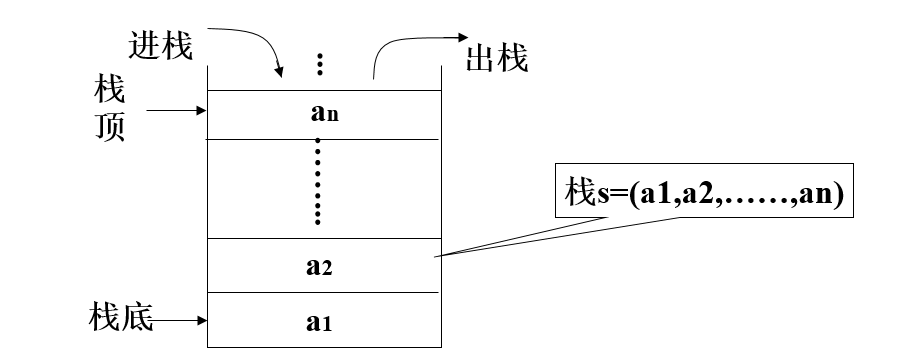

# **数据结构与算法-Day01**


## **算法概述**

- **算法-前序**

  ```python
  【1】Everybody!全场动作必须跟我整齐划一，来，我们一起来做一道题
      若n1+n2+n3=1000,且n1^2+n2^2=n3^2(n1,n2,n3为自然数),求出所有n1、n2、n3可能的组合
  
  【2】解题思路
      n1 = 0
      n2 = 0 
      n3 = 0
      判断n1+n2+n3是否等于1000,之后变n3=1,n3=2,n3=3,... 然后再变n2
  
  【3】代码实现
      import time
  
      start_time = time.time()
      for n1 in range(0,1001):
          for n2 in range(0,1001):
              for n3 in range(0,1001):
                  if n1 + n2 + n3 == 1000 and n1**2 + n2**2 == n3**2:
                      print('[%d,%d,%d]' % (n1,n2,n3))
      end_time = time.time()
      print('执行时间:%.2f' % (end_time-start_time))
      
  【4】算法概念
      4.1) 解决问题的方法，是指解题方案的准确而完整的描述，是一系列解决问题的清晰指令
      4.2) 算法代表着用系统的方法描述解决问题的策略机制
  ```


## **时间复杂度概述**

- **时间复杂度 - 前序**

  ```python
  【1】各位，一万年太久，只争朝夕，来提升一下上题的效率吧！！！
      for n1 in range(0,1001):
          for n2 in range(0,1001):
              n3 = 1000 - n1 - n2
              if n1**2 + n2**2 == n3**2:
                  print('[%d,%d,%d]'%(n1,n2,n3))
  
  【2】总结与思考 : 解决同一个问题有多种算法,但是效率有区别,那么如何衡量呢？
      2.1) 执行时间反应算法效率 - 绝对靠谱吗？
           不是绝对靠谱: 因机器配置有高有低,不能冒然绝对去做衡量
    
      2.2) 那如何衡量更靠谱？？？
           运算数量 - 执行步骤的数量
         
  【4】时间复杂度概念
      4.1) 同一个算法，由于机器配置差异,每台机器执行的总时间不同,但是执行基本运算的数量大体相同，所以把算法执行步骤的数量称为时间复杂度
  ```

- **时间复杂度 - 大O表示法前序**

  ```python
  ################################################################
  【1】计算此算法的时间复杂度
      for n1 in range(0,1001):
          for n2 in range(0,1001):
              for n3 in range(0,1001):
                  if n1 + n2 + n3 == 1000 and n1**2 + n2**2 == n3**2:
                      print('[%d,%d,%d]' % (n1,n2,n3))
  ################################################################
  【2】计算步骤                
      T = 1000 * 1000 * 1000 * 2
      T = n * n * n * 2
      T(n) = n ** 3 * 2  即时间复杂度为: T(n)=n**3 * 2
  
  【3】时间复杂度T(n)的 大O表示法
      3.1) 函数1: T(n)=k * n**3 + c
      3.2) 函数2: g(n)=n**3
      3.3) 特点: 在趋向无穷的极限意义下，函数T(n)的增长速度受到函数g(n)的约束，也为函数T(n)与函数g(n)的特征相似，则称 g(n) 是 T(n) 的渐近函数，大O表示法则使用渐近函数来表示
          即: O(g(n)) 
          即: O(n^3)
          即: 上述时间复杂度为 O(n^3)
  
  【4】时间复杂度总结           
      4.1) 假设存在函数g，使得算法A处理规模为n的问题所用时间为T(n)=O(g(n))，则称O(g(n))为算法A的渐近时间复杂度，简称时间复杂度，记为T(n)
      4.2） 对算法进行特别具体细致分析虽然好，但实践中实际价值有限。对我们来说算法的时间性质和空间性质最重要的是数量级和趋势，这些是分析算法效率的主要部分。所以忽略系数，忽略常数，比如5*n^2 和 100*n^2属于一个量级，时间复杂度为O(n^2)
  ```

- **时间复杂度分类**

  ```python
  【1】最优时间复杂度 - 最少需要多少个步骤
  【2】最坏时间复杂度 - 最多需要多少个步骤
  【3】平均时间复杂度 - 平均需要多少个步骤
  
  我们平时所说的时间复杂度,指的是最坏时间复杂度
  ```

## **时间复杂度 - 计算规则**

- **计算原则**

  ```python
  【1】基本操作,只有常系数，认为其时间复杂度为O(1)
      顺序 - 基本步骤之间的累加
      print('abc') -> O(1)
      print('abc') -> O(1)
  
  【2】循环: 时间复杂度按乘法进行计算
      
  【3】分支: 时间复杂度取最大值(哪个分支执行次数多算哪个)
  
  【4】练习:请计算如下代码的时间复杂度
      for n1 in range(0,1001):
          for n2 in range(0,1001):
              n3 = 1000 - n1 - n2
              if n1**2 + n2**2 == n3**2:
                  print('[%d,%d,%d]'%(n1,n2,n3))
              
  T(n) = n * n * (1+1+max(1,0))
  T(n) = n**2 * 3
  T(n) = n**2
  T(n) = O(n**2)
  用大O表示法表示为 Tn = O(n^2)
  ```

- **常见时间复杂度**

  | 执行次数           | 时间复杂度 | 阶     |
  | ------------------ | ---------- | ------ |
  | 20（20个基本步骤） | O(1)       | 常数阶 |
  | 8n+6               | O(n)       | 线性阶 |
  | 2n^2 + 4n + 2      | O(n^2)     | 平方阶 |
  | 8logn + 16         | O(logn)    | 对数阶 |
  | 4n + 3nlogn + 22   | O(nlog(n)) | nlog阶 |
  | 2n^3 + 2n^2 + 4    | O(n^3)     | 立方阶 |
  | 2 ^ n              | O(2^n)     | 指数阶 |

- **O(1)**

  ```python
  【1】O(1)
      print('全场动作必须跟我整齐划一')
  
  【2】O(1)
      print('左边跟我一起画个龙')
      print('在你右边画一道彩虹')
      print('走起')
      print('左边跟我一起画彩虹')
      print('在你右边再画一条龙')
  ```

- **O(n)**

  ```python
  for i in range(n):
    print('在胸口比划一个郭富城')
  ```

- **O(n^2)**

  ```python
  【1】O(n^2)
      for i in range(n):
          for j in range(n):
              print('左边右边摇摇头')
      
  【2】O(n^2)
      for i in range(n):
          print('两根手指就像两个窜天猴')
          for j in range(n):
              print('指向闪耀的灯球')
  ```
  
- **O(n^3)**

  ```python
  for i in range(n):
      for j in range(n):
          for k in range(n):
              print('走你')
  ```

- **O(logn)**

  ```python
  n = 64
  while n > 1:
      print(n)
      n = n // 2
  
  【解释】
  2的6次方 等于 64，log264 = 6，所以循环减半的时间复杂度为O(log2n)，即O(logn)
  如果是循环减半的过程，时间复杂度为O(logn)或O(log2n)
  ```

- **O(nlogn)**

  ```python
  n = 64
  while n > 1:
    	for i in range(n):
      	print('哪里有彩虹告诉我')
      n = n // 2
  ```

- **常见时间复杂度排序**

  ```python
  O(1)<O(logn)<O(n)<O(nlogn)<O(n2)<O(n2logn)<O(n3)
  ```

- **练习: 写出如下的时间复杂度**

  ```python
  O(5)          --> O(1)
  O(2n+1)       --> O(n)
  O(n**2+n+1)   --> O(n**2)
  O(3n**3+1)    --> O(n**3)
  ```

## **数据结构概述**

- **数据结构**

  ```python
  【1】概述
      1.1) 在工作中，我们为了解决问题，需要将数据保存下来，然后根据数据存储方式设计算法进行处理，根据数据的存储方式我们使用不同的算法处理，而我们现在需要考虑算法解决问题的效率问题，所以需要考虑数据究竟如何保存，这就是数据结构
    
  【2】概念
      2.1) 数据是一个抽象的概念，将其进行分类后得到程序设计语言中的基本类型，如：list、tuple等。数据元素之间不是独立的，存在特定的关系，这些关系便是结构。数据结构指数据对象中数据元素之间的关系
      2.2) Python提供了很多现成的数据结构类型，如列表、元组、字典等，无须我们自己去定义，而Python没有定义的，就需要我们自己去定义实现这些数据的组织方式，称为Python扩展数据结构，如：栈、队列等
  
  【3】为什么学习数据结构
     在真正的项目开发中，大部分时间都是从数据库取数据 -> 数据操作和结构化 -> 返回给前端，在数据操作过程中需要合理地抽象，组织、处理数据，如果选用了错误的数据结构，就会造成代码运行低效
  ```
  
- **数据结构 - 关系**

  ```python
  【1】线性结构 : n个数据元素的有序集合
      1.2) 顺序表 : 将数据结构中各元素按照其逻辑顺序存放于存储器一片连续的存储空间中
      1.3) 链表   : 将数据结构中各元素分布到存储器的不同点，用记录下一个结点位置的方式建立它们之间的联系
      1.4) 栈 : 后进先出
      1.5) 队列 : 先进先出
      
  【2】非线性结构
      2.1) 树形结构
      2.2) 图状结构
  ```

- **数据结构+算法总结**

  ```python
  【1】数据结构只是静态描述了数据元素之间的关系
  【2】高效的程序需要在数据结构的基础上设计和选择算法
  【3】程序 = 数据结构 + 算法
  【4】算法是为了解决实际问题而设计的，数据结构是算法需要处理的问题载体
  ```

## **抽象数据类型**

- **概念**

  ```python
  【1】定义
      抽象数据类型是指一个数学模型以及定义在此数学模型上的一组操作，及把数据类型和数据类型上的运算捆在一起进行封装。引入抽象数据类型的目的是把数据类型的表示和数据类型上的运算的实现与这些数据类型和运算在程序中的引用隔开，使他们相互独立
  
  【2】描述
      把原有的基本数据和这个数据所支持的操作放到一起，形成一个整体
  
  【3】最常用的数据运算
      3.1) 插入
      3.2) 删除
      3.3) 修改
      3.4) 查找
      3.5) 排序
  ```

## **线性表 - 顺序表**


- **顺序表的基本形式**

  ```python
  【1】特点 : 内存连续
  【2】分类
      2.1) 基本形式: 数据元素本身连续存储,每个元素所占存储单元大小固定相同
      2.2) 元素外置: 数据元素不连续存储，地址单元连续存储
  ```

## **线性表 - 链表**

- **定义**

  ```python
  【1】特点:
      1.1) 内存不连续的，而是一个个串起来的，需要每个链表的节点保存一个指向下一个节点的指针
    
  【2】和顺序表的对比
      2.1) 顺序表的构建需要预先知道数据大小来申请连续的存储空间，而在进行扩充时又需要进行数据的搬迁，使用起来不灵活，而链表结构可以充分利用计算机的内存空间，实现灵活的内存动态管理
  ```

- **示例 - 强化理解**

  ```python
  将线性表L=(a0,a1,……,an-1)中各元素分布在存储器的不同存储块，称为结点，每个结点（尾节点除外）中都持有一个指向下一个节点的引用，这样所得到的存储结构为链表结构
  ```

  

- **单链表 - 代码实现**

  ```python
  # 单链表
  class Node(object):
      """节点"""
      def __init__(self,elem):
          self.elem = elem
          self.next = None
  
  class SingleLinkList(object):
      """单链表"""
      def __init__(self,node=None):
          self.head = node
  
      def is_empty(self):
          """链表是否为空"""
          return self.head == None
  
      def length(self):
          """链表长度"""
          # current游标,用来移动遍历节点
          current = self.head
          # count记录数量
          count = 0
          while current != None:
              count += 1
              current = current.next
          return count
  
      def travel(self):
          """遍历整个链表"""
          current = self.head
          while current != None:
              print(current.elem,end=" ")
              current = current.next
          print()
  
      def add(self,item):
          """链表头部添加元素"""
          node = Node(item)
          node.next = self.head
          self.head = node
  
      def append(self,item):
          """链表尾部添加元素"""
          node = Node(item)
          if self.is_empty():
              self.head = node
          else:
              current = self.head
              while current.next != None:
                  current = current.next
              current.next = node
  
      def insert(self,position,item):
          """指定位置添加元素
          :param pos 从0开始
          """
          if position <= 0:
              self.add(item)
          elif position > self.length()-1:
              self.append(item)
          else:
              pre = self.head
              count = 0
              while count < (position-1):
                  count += 1
                  pre = pre.next
              # 当循环结束后,pre指向position-1的位置
              node = Node(item)
              node.next = pre.next
              pre.next = node
  
      def remove(self,item):
          """删除节点
          特殊情况:1.空链表
          特殊情况:2.恰巧删除头节点
          特殊情况:3.只有1个节点
          """
          current = self.head
          pre = None
          while current != None:
              if current.elem == item:
                  # 先判断此节点是否为头节点
                  if current == self.head:
                      self.head = current.next
                  else:
                      pre.next = current.next
                  break
              else:
                  pre = current
                  current = current.next
  
      def search(self,item):
          """查找节点是否存在"""
          current = self.head
          while current != None:
              if current.elem == item:
                  return True
              else:
                  current = current.next
          return False
  
  if __name__ == '__main__':
      sll = SingleLinkList()
      print(sll.is_empty())
      print(sll.length())
  
      sll.add(1)
      sll.append(2)
      print(sll.is_empty())
      print(sll.length())
  
      sll.append(3)
      sll.append(4)
      sll.append(5)
      sll.append(6)
      sll.insert(-1,'我是-1')
      sll.insert(2,'我是2')
      sll.travel()
      sll.remove(4)
      sll.travel()
  ```
  

## **栈（LIFO)**

- **定义**

  ```python
  栈是限制在一端进行插入操作和删除操作的线性表（俗称堆栈），允许进行操作的一端称为"栈顶"，另一固定端称为"栈底"，当栈中没有元素时称为"空栈"
  ```

- **特点**

  ```python
  【1】栈只能在一端进行数据操作
  【2】栈模型具有先进后出或者叫做后进先出的规律
  ```



- **栈的代码实现**

  ```python
  # 栈的操作有入栈（压栈），出栈（弹栈），判断栈是否为空等操作
  """
  sstack.py  栈模型的顺序存储
  重点代码
  
  思路:
  1. 利用列表完成顺序存储,但是列表功能多,不符合栈模型特点
  2. 使用类将列表封装,提供符合栈特点的接口方法
  """
  
  # 顺序栈模型
  class Stack(object):
      def __init__(self):
          # 开辟一个顺序存储的模型空间
          # 列表的尾部表示栈顶
          self.elems = []
  
      def is_empty(self):
          """判断栈是否为空"""
          return self.elems == []
  
      def push(self,val):
          """入栈"""
          self.elems.append(val)
  
      def pop(self):
          """出栈"""
          if self.is_empty():
              raise StackError("pop from empty stack")
          # 弹出一个值并返回
          return self.elems.pop()
  
      def top(self):
          """查看栈顶元素"""
          if self.is_empty():
              raise StackError("Stack is empty")
          return self.elems[0]
  
  
  if __name__ == '__main__':
      st = Stack()
      st.push(1)
      st.push(3)
      st.push(5)
      print(st.top())
      while not st.is_empty():
          print(st.pop())
  ```

## **队列（FIFO）**

- **定义**

  ```python
  队列是限制在两端进行插入操作和删除操作的线性表，允许进行存入操作的一端称为"队尾"，允许进行删除操作的一端称为"队头"
  ```

- **特点**

  ```python
  1) 队列只能在队头和队尾进行数据操作
  2) 队列模型具有先进先出或者叫做后进后出的规律
  ```


- **队列的代码实现** 

  ```python
  # 队列的操作有入队，出队，判断队列的空满等操作
  """
  思路分析:
  1. 基于列表完成数据的存储
  2. 通过封装功能完成队列的基本行为
  3. 无论那边做对头/队尾 都会在操作中有内存移动
  """
  
  # 队列操作
  class SQueue:
      def __init__(self):
          self.elems = []
  
      # 判断队列是否为空
      def is_empty(self):
          return self.elems == []
  
      # 入队
      def enqueue(self,val):
          self.elems.append(val)
  
      # 出队
      def dequeue(self):
          if not self._elems:
              raise Exception("Queue is empty")
          return self.elems.pop(0) # 弹出第一个数据
  
  
  if __name__ == '__main__':
      sq = SQueue()
      sq.enqueue(10)
      sq.enqueue(20)
      sq.enqueue(30)
      while not sq.is_empty():
          print(sq.dequeue())
  ```

  ## **递归**

  - **递归定义及特点**

    ```python
    【1】定义
        递归用一种通俗的话来说就是自己调用自己，但是需要分解它的参数，让它解决一个更小一点的问题，当问题小到一定规模的时候，需要一个递归出口返回
        
    【2】特点
        2.1) 递归必须包含一个基本的出口，否则就会无限递归，最终导致栈溢出
        2.2) 递归必须包含一个可以分解的问题，要想求得 fact(n)，就需要用 n * fact(n-1)
        2.3) 递归必须必须要向着递归出口靠近，这里每次递归调用都会 n-1，向着递归出口 n == 0 靠近
    ```

  - **递归示例1**

    ```python
    def f(n):
        if n == 0:
            return 
        print(n)
        f(n-1)
    
    f(3)
    # 结果: 3 2 1
    ```

  - 

  

  - **递归示例2**

    ```python
    def f(n):
      if n == 0:
        return 
      f(n-1)
      print(n)
      
    f(3)
    # 结果: 1 2 3
    ```

    

  - **递归示例3**

    ```python
    # 打印 1+2+3+...+n 的和
    def sumn(n):
      if n == 0:
        return 0
      return n + sumn(n-1)
    
    print(sumn(3))
    ```

    

  - **递归练习**

    ```python
    # 使用递归求出 n 的阶乘
    def fac(n):
      if n == 1:
        return 1
      return n * fac(n-1)
    
    print(fac(5))
    ```

  - **递归总结**

    ```python
    【1】调用递归之前的语句，从外到内执行，最终回归
    【2】调用递归或之后的语句，从内到外执行，最终回归
    【3】Python默认递归深度有限制，当递归深度超过默认值时，就会引发RuntimeError，默认值998
    【4】手动设置递归调用深度
        import sys
        sys.setrecursionlimit(1000000) #表示递归深度为100w
    ```

    ## **今日作业**

    ```python
    【1】手写单链表
    【2】尝试使用链表实现 栈
    【3】尝试使用链表实现 队列
    【4】仔细研究递归,熟练递归思想
    【5】输入一个链表，按链表值从尾到头的顺序返回一个 array_list
    ```

    
