# 生成对抗网络（GAN）

## 一、概述

生成对抗网络（Generative Adversarial Networks）是一种无监督深度学习模型，用来通过计算机生成数据，由Ian J. Goodfellow等人于2014年提出。模型通过框架中（至少）两个模块：生成模型（Generative Model）和判别模型（Discriminative Model）的互相博弈学习产生相当好的输出。生成对抗网络被认为是当前最具前景、最具活跃度的模型之一，目前主要应用于样本数据生成、图像生成、图像修复、图像转换、文本生成等方向。

GAN这种全新的技术在生成方向上带给了人工智能领域全新的突破。在之后的几年中生GAN成为深度学习领域中的研究热点，近几年与GAN有关的论文数量也急速上升，目前数量仍然在持续增加中。


<center><font size=2>GAN论文数量增长示意图</font></center>
2018年，对抗式神经网络的思想被《麻省理工科技评论》评选为2018年“全球十大突破性技术”（10 Breakthrough Technologies）之一。 Yann LeCun（“深度学习三巨头”之一，纽约大学教授，前Facebook首席人工智能科学家）称赞生成对抗网络是“过去20年中深度学习领域最酷的思想”，而在国内被大家熟知的前百度首席科学家Andrew Ng也把生成对抗网络看作“深度学习领域中一项非常重大的进步”。

## 二、GAN基本原理

### 1. 构成

GAN由两个重要的部分构成：生成器(Generator，简写作G)和判别器(Discriminator，简写作D)。

- 生成器：通过机器生成数据，目的是尽可能“骗过”判别器，生成的数据记做G(z)；
- 判别器：判断数据是真实数据还是「生成器」生成的数据，目的是尽可能找出「生成器」造的“假数据”。它的输入参数是x，x代表数据，输出D（x）代表x为真实数据的概率，如果为1，就代表100%是真实的数据，而输出为0，就代表不可能是真实的数据。

这样，G和D构成了一个动态对抗（或博弈过程），随着训练（对抗）的进行，G生成的数据越来越接近真实数据，D鉴别数据的水平越来越高。在理想的状态下，G可以生成足以“以假乱真”的数据；而对于D来说，它难以判定生成器生成的数据究竟是不是真实的，因此D(G(z)) = 0.5。训练完成后，我们得到了一个生成模型G，它可以用来生成以假乱真的数据。


<center><font size=2>GAN示意图</font></center>
### 2. 训练过程

- 第一阶段：固定「判别器D」，训练「生成器G」。使用一个性能不错的判别器，G不断生成“假数据”，然后给这个D去判断。开始时候，G还很弱，所以很容易被判别出来。但随着训练不断进行，G技能不断提升，最终骗过了D。这个时候，D基本属于“瞎猜”的状态，判断是否为假数据的概率为50%。
- 第二阶段：固定「生成器G」，训练「判别器D」。当通过了第一阶段，继续训练G就没有意义了。这时候我们固定G，然后开始训练D。通过不断训练，D提高了自己的鉴别能力，最终他可以准确判断出假数据。
- 重复第一阶段、第二阶段。通过不断的循环，「生成器G」和「判别器D」的能力都越来越强。最终我们得到了一个效果非常好的「生成器G」，就可以用它来生成数据。

### 3. GAN的优缺点

1）优点

- 能更好建模数据分布（图像更锐利、清晰）；
- 理论上，GANs 能训练任何一种生成器网络。其他的框架需要生成器网络有一些特定的函数形式，比如输出层是高斯的；
- 无需利用马尔科夫链反复采样，无需在学习过程中进行推断，没有复杂的变分下界，避开近似计算棘手的概率的难题。

2）缺点

- 模型难以收敛，不稳定。生成器和判别器之间需要很好的同步，但是在实际训练中很容易D收敛，G发散。D/G 的训练需要精心的设计。
- 模式缺失（Mode Collapse）问题。GANs的学习过程可能出现模式缺失，生成器开始退化，总是生成同样的样本点，无法继续学习。

### 4. GAN的应用

#### 1）生成数据集

人工智能的训练是需要大量的数据集，可以通过GAN自动生成低成本的数据集。

#### 2）人脸生成


#### 3）物品生成

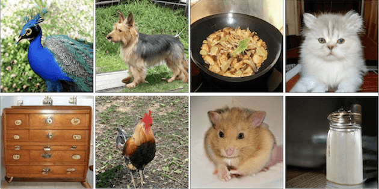

#### 4）图像转换


#### 5）图像修复


## 三、GAN的数学原理

### 1.GAN的数学推导

生成模型会从一个输入空间将数据映射到生成空间（即通过输入数据，在函数作用下生成输出数据），写成公式的形式是x=G（z）。通常，输入z会满足一个简单形式的随机分布（比如高斯分布或者均匀分布等），为了使得生成的数据分布能够尽可能地逼近真实数据分布，生成函数G会是一个神经网络的形式，通过神经网络可以模拟出各种完全不同的分布类型。

以下是生成对抗网络中的代价函数，以判别器D为例，代价函数写作$J^{（D）}$，形式如下所示:


其中，E表示期望概率，$x \sim P_{data}$表示x满足$P_{data}$分布。

对于生成器来说它与判别器是紧密相关的，我们可以把两者看作一个零和博弈，它们的代价综合应该是零，所以生成器的代价函数应满足如下等式：
$$
J^{(G)} = -J^{(D)}
$$
这样一来，我们可以设置一个价值函数V来表示$J^{（G）}$和$J^{（D）}$：

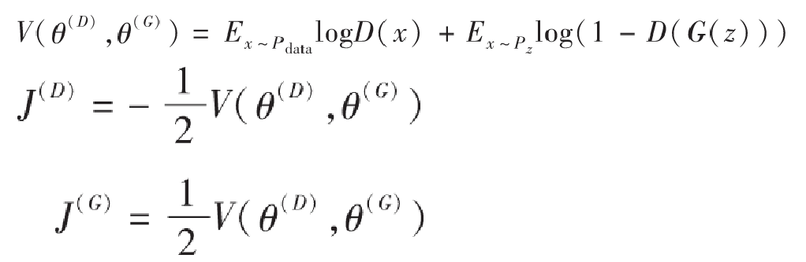

我们现在把问题变成了需要寻找一个合适的$V(θ^{(D)}，θ^{(G)})$使得$J^{（G）}$和$J^{（D）}$都尽可能小，也就是说**对于判别器而言越大越$V(θ^{(D)}，θ^{(G)})$好，而对于生成器来说则是越小越好$V(θ^{(D)}，θ^{(G)})$**，从而形成了两者之间的博弈关系。

在博弈论中，博弈双方的决策组合会形成一个纳什平衡点（Nash equilibrium），在这个博弈平衡点下博弈中的任何一方将无法通过自身的行为而增加自己的收益。在生成对抗网络中，我们要计算的纳什平衡点正是要寻找一个生成器G与判别器D使得各自的代价函数最小，从上面的推导中也可以得出我们希望找到一个$V(θ^{(D)}，θ^{(G)})$对于生成器来说最小而对判别器来说最大，我们可以把它定义成一个寻找极大极小值的问题，公式如下所示：

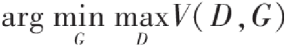

我们可以用图形化的方法理解一下这个极大极小值的概念，一个很好的例子就是鞍点（saddle point），如下图所示，即在一个方向是函数的极大值点，而在另一个方向是函数的极小值点。

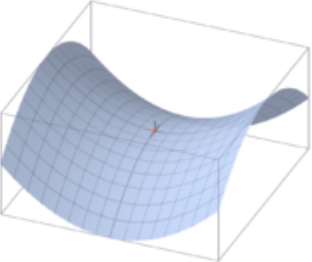

在上面公式的基础上，我们可以分别求出理想的判别器D\*和生成器G\*：


下面我们先来看一下如何求出理想的判别器，对于上述的D*，我们假定生成器G是固定的，令式子中的G（z）=x。推导如下：


我们现在的目标是希望寻找一个D使得V最大，我们希望对于积分中的项$f（x）=p_{data}（x）logD（x）＋p_g（x）log（1-D（x））$，无论x取何值都能最大。其中，我们已知$p_data$是固定的，之前我们也假定生成器G固定，所以$p_g$也是固定的，所以我们可以很容易地求出D以使得f（x）最大。我们假设x固定，f（x）对D（x）求导等于零，下面是求解D（x）的推导。


可以看出它是一个范围在0到1的值，这也符合我们判别器的模式，理想的判别器在接收到真实数据时应该判断为1，而对于生成数据则应该判断为0，当生成数据分布与真实数据分布非常接近的时候，应该输出的结果为1/2.


找到了D\*之后，我们再来推导一下生成器G\*。现在先把D\*（x）代入前面的积分式子中重新表示：

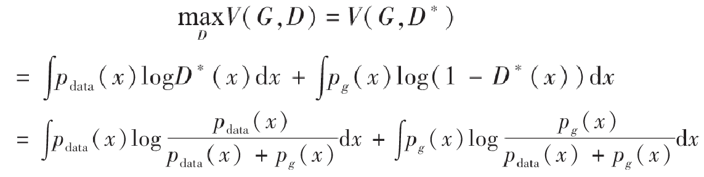

到了这一步，我们需要先介绍一个定义——Jensen–Shannon散度，我们这里简称JS散度。在概率统计中，JS散度也与前面提到的KL散度一样具备了测量两个概率分布相似程度的能力，它的计算方法基于KL散度，继承了KL散度的非负性等，但有一点重要的不同，JS散度具备了对称性。JS散度的公式如下，我们还是以P和Q作为例子，另外我们设定$M=\frac{1}{2}(P+Q)$，KL为KL散度公式。


对于上面的$MaxV(G,D)$，由于JS散度是非负的，当且仅当$p_{data}=p_g$的时候，上式可以取得全局最小值$-log（4）$。所以我们要求的最优生成器G\*，正是要使得G*的分布$p_g=p_{data}$.

### 2. GAN的可视化理解

下面我们用一个可视化概率分布的例子来更深入地认识一下生成对抗网络。Ian Goodfellow的论中给出了这样一个GAN的可视化实现的例子：下图中的点线为真实数据分布，曲线为生成数据样本，生成对抗网络在这个例子中的目标在于，让曲线（也就是生成数据的分布）逐渐逼近点线（代表的真实数据分布）。

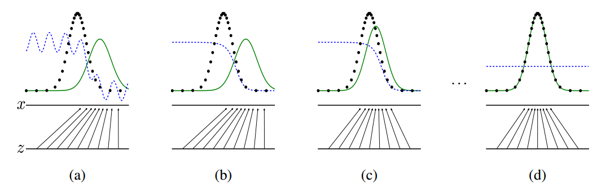

虚线为生成对抗网络中的判别器，它被赋予了初步区分真实数据与生成数据的能力，并对于它的划分性能加上一定的白噪声，使得模拟环境更为真实。输入域为z（图中下方的直线）在这个例子里默认为一个均匀分布的数据，生成域为x（图中上方的直线）为不均匀分布数据，通过生成函数x=G（z）形成一个映射关系，如图中的那些箭头所示，将均匀分布的数据映射成非均匀数据。

从a到d的四张图可以展现整个生成对抗网络的运作过程。在a图中，可以说是一种初始的状态，生成数据与真实数据还有比较大的差距，判别器具备初步划分是否为真实数据的能力，但是由于存在噪声，效果仍有缺陷。b图中，通过使用两类标签数据对于判别器的训练，判别器D开始逐渐向一个比较完善的方向收敛，最终呈现出图中的结果。当判别器逐渐完美后，我们开始迭代生成器G，如图c所示。通过判别器D的倒数梯度方向作为指导，我们让生成数据向真实数据的分布方向移动，让生成数据更容易被判别器判断为真实数据。在反复的一系列上述训练过程后，生成器与判别器会进入图d的最终状态，此时$p_g$会非常逼近甚至完全等于$p_{data}$，当达到理想的$p_g=p_{data}$的时候，D与G都已经无法再更进一步优化了，此时G生成的数据已经达到了我们期望的目的，能够完全模拟出真实数据的分布，而D在这个状态下已经无法分辨两种数据分布（因为它们完全相同），此时$D(x)=\frac{1}{2}$.

## 四、DCGAN

### 1. 概述

DCGAN的创始论文《Unsupervised Representation Learning with Deep Convolutional Generative Adversarial Networks》（基于深层卷积生成对抗网络的无监督表示学习）发表于2015年，文章在GAN的基础之上提出了全新的DCGAN架构，该网络在训练过程中状态稳定，并可以有效实现高质量的图片生成及相关的生成模型应用。由于其具有非常强的实用性，在它之后的大量GAN模型都是基于DCGAN进行的改良版本。为了使得GAN能够很好地适应于卷积神经网络架构，DCGAN提出了四点架构设计规则，分别是：

- 使用卷积层替代池化层。首先第一点是把传统卷积网络中的池化层全部去除，使用卷积层代替。对于判别器，我们使用步长卷积（strided convolution）来代替池化层；对于生成器，我们使用分数步长卷积（fractional-strided convolutions）来代替池化层。
- 去除全连接层。目前的研究趋势中我们会发现非常多的研究都在试图去除全连接层，常规的卷积神经网络往往会在卷积层后添加全连接层用以输出最终向量，但我们知道全连接层的缺点在于参数过多，当神经网络层数深了以后运算速度会变得非常慢，此外全连接层也会使得网络容易过度拟合。有研究使用了全局平均池化（global average pooling）来替代全连接层，可以使得模型更稳定，但也影响了收敛速度。论文中说的一种折中方案是将生成器的随机输入直接与卷积层特征输入进行连接，同样地对于判别器的输出层也是与卷积层的输出特征连接，具体的操作会在后面的框架结构介绍中说明。
- 使用批归一化（batch normalization）。由于深度学习的神经网络层数很多，每一层都会使得输出数据的分布发生变化，随着层数的增加网络的整体偏差会越来越大。批归一化的目标则是为了解决这一问题，通过对每一层的输入进行归一化处理，能够有效使得数据服从某个固定的数据分布。
- 使用恰当的激活函数。在DCGAN网络框架中，生成器和判别器使用了不同的激活函数来设计。生成器中使用ReLU函数，但对于输出层使用了Tanh激活函数，因为研究者们在实验中观察到使用有边界的激活函数可以让模型更快地进行学习，并能快速覆盖色彩空间。而在判别器中对所有层均使用LeakyReLU，在实际使用中尤其适用于高分辨率的图像判别模型。这些激活函数的选择是研究者在多次实验测试中得出的结论，可以有效使得DCGAN得到最优的结果。

### 2. 网络结构

下图是DCGAN生成器G的架构图，输入数据为100维的随机数据z，服从范围在[-1，1]的均匀分布，经过一系列分数步长卷积后，最后形成一幅64×64×3的RGB图片，与训练图片大小一致。

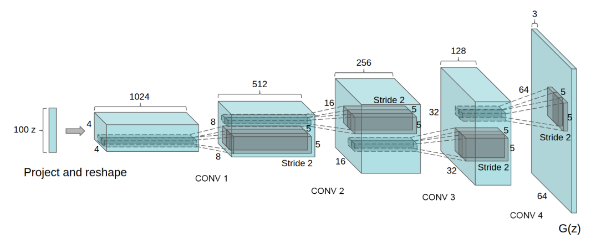

对于判别器D的架构，基本是生成器G的反向操作，如下图所示。输入层为64×64×3的图像数据，经过一系列卷积层降低数据的维度，最终输出的是一个二分类数据。

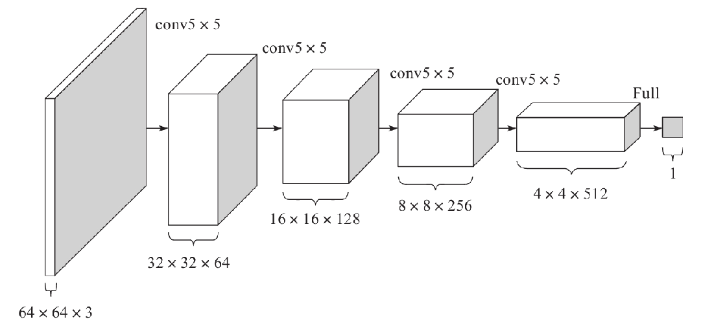

### 3. 训练细节

1）对于用于训练的图像数据样本，仅将数据缩放到[-1，1]的范围内，这个也是tanh的取值范围，并不做任何其他处理。

2）模型均采用Mini-Batch大小为128的批量随机梯度下降方法进行训练。权重的初始化使用满足均值为0、方差为0.02的高斯分布的随机变量。

3）对于激活函数LeakyReLU，其中Leak的部分设置斜率为0.2。

4）训练过程中使用Adam优化器进行超参数调优。学习率使用0.0002，动量β1取0.5，使得训练更加稳定。


## 五、实现DCGAN

### 1. 任务目标

实现DCGAN，并利用其合成卡通人物头像。

### 2. 数据集

样本内容：卡通人物头像

样本数量：51223个

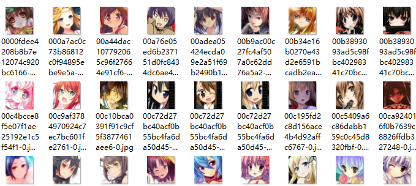

### 3. 代码清单

1）avatar.py

```python
import os
import scipy.misc
import numpy as np
from glob import glob


# Avatar(化身)类
class Avatar:

    def __init__(self):
        self.data_name = 'faces'
        self.source_shape = (96, 96, 3)
        self.resize_shape = (48, 48, 3)
        self.crop = True  # 裁剪
        self.img_shape = self.source_shape if not self.crop else self.resize_shape  # 图片形状
        self.img_list = self._get_img_list()  # 加载所有图片
        self.batch_size = 64  # batch_size大小
        self.batch_shape = (self.batch_size,) + self.img_shape
        self.chunk_size = len(self.img_list) // self.batch_size  # 总批次数量 = 样本数 / 批次大小

    def _get_img_list(self):
        """
        加载所有图片样本路径
        :return:所有图片样本路径列表
        """
        path = os.path.join(os.getcwd(), self.data_name, '*.jpg')
        return glob(path)

    def _get_img(self, name):
        """
        读取图像数据
        :param name: 图片路径
        :return: 图像数据
        """
        assert name in self.img_list
        img = scipy.misc.imread(name).astype(np.float32)  # 读取图像
        assert img.shape == self.source_shape
        return self._resize(img) if self.crop else img  # 调整大小并返回

    def _resize(self, img):
        h, w = img.shape[:2]
        resize_h, resize_w = self.resize_shape[:2]
        crop_h, crop_w = self.source_shape[:2]
        j = int(round((h - crop_h) / 2.))
        i = int(round((w - crop_w) / 2.))
        cropped_image = scipy.misc.imresize(img[j:j + crop_h, i:i + crop_w], [resize_h, resize_w])
        return np.array(cropped_image) / 127.5 - 1.

    @staticmethod
    def save_img(image, path):
        scipy.misc.imsave(path, image)
        return True

    def batches(self):
        start = 0
        end = self.batch_size

        for _ in range(self.chunk_size):
            name_list = self.img_list[start:end]
            imgs = [self._get_img(name) for name in name_list]
            batches = np.zeros(self.batch_shape)
            batches[::] = imgs
            yield batches
            start += self.batch_size
            end += self.batch_size


if __name__ == '__main__':
    avatar = Avatar()
    batch = avatar.batches()
    b = next(batch)
    for num in range(len(b)):
        avatar.save_img(b[num], 'samples' + os.sep + str(num) + '.jpg')
```

2）avatar_model.py

```python
# DCGAN
# Date: 2020/04/30
# Author: wdb

import os
import math
import numpy as np
import tensorflow as tf
from datetime import datetime
# from avatarDcgan.avatar import Avatar
from avatar import Avatar  # wdb 20200325


class AvatarModel:
    def __init__(self):
        self.avatar = Avatar()

        # 真实图片shape (height, width, depth)
        self.img_shape = self.avatar.img_shape  # (48,48,3)
        # 一个batch图片shape (batch, height, width, depth)
        self.batch_shape = self.avatar.batch_shape
        # 一个batch包含的图片数量
        self.batch_size = self.avatar.batch_size
        # batch数量
        self.chunk_size = self.avatar.chunk_size

        self.noise_img_size = 100  # 白噪声图片大小
        self.gf_size = 64  # 卷积转置通道数量
        self.df_size = 64  # 卷积输出通道数量
        self.epoch_size = 1  # 训练循环次数
        self.learning_rate = 0.0002  # 学习率
        self.beta1 = 0.5  # 优化指数衰减率
        self.sample_size = 64  # 生成图像数量(和avatar类中batch_size数量要一致, 不然生成图像报错)

    @staticmethod
    def conv_out_size_same(size, stride):
        """
        计算每层高度、宽度
        :param size:
        :param stride:
        :return:
        """
        return int(math.ceil(float(size) / float(stride)))

    @staticmethod
    def linear(images, output_size, stddev=0.02, bias_start=0.0, name="Linear"):
        """
        计算线性模型 wx + b
        :param images: 输入数据 (x)
        :param output_size: 输出值大小
        :param stddev: 创建正态分布张量的标准差
        :param bias_start: 偏置初始值
        :param name: 变量作用域名称
        :return: 返回计算结果及参数
        """
        shape = images.get_shape().as_list()  # 取出输入数据形状并转换为列表

        with tf.variable_scope(name):
            w = tf.get_variable("w",  # 名称
                                [shape[1], output_size],  # 矩阵行、列
                                tf.float32,  # 类型
                                tf.random_normal_initializer(stddev=stddev))  # 初始值
            b = tf.get_variable("b",  # 名称
                                [output_size],  # 个数等于列数
                                initializer=tf.constant_initializer(bias_start))  # 初始值

            return tf.matmul(images, w) + b, w, b

    @staticmethod
    def batch_normailizer(x, epsilon=1e-5, momentum=0.9, train=True, name="batch_norm"):
        """
        批量归一化
        :param x: 输入
        :param epsilon: 给一个很小的值，避免除数为0的情况
        :param momentum: 衰减系数, 推荐使用0.9
        :param train: 图否处于训练模式
        :param name: 变量作用域名称
        :return:
        """
        with tf.variable_scope(name):
            return tf.contrib.layers.batch_norm(x,  # 输入
                                                decay=momentum,  # 衰减系数, 推荐使用0.9
                                                updates_collections=None,
                                                epsilon=epsilon,  # 避免被零除
                                                scale=True,  # 是否缩放
                                                is_training=train)  # 图否处于训练模式

    @staticmethod
    def conv2d(images, output_dim, stddev=0.02, name="conv2d"):
        """
        二维卷积
        :param images: 图像数据
        :param output_dim: 输出数据大小
        :param stddev: 创建正态分布张量的标准差
        :param name: 变量作用域名称
        :return:
        """
        with tf.variable_scope(name):
            # filter: [height, width, in_channels, output_channels]
            filter_shape = [5, 5, images.get_shape()[-1], output_dim]
            strides_shape = [1, 2, 2, 1]  # 步长

            w = tf.get_variable("w",  # 名称
                                filter_shape,
                                initializer=tf.random_normal_initializer(stddev=stddev))  # 初始值
            b = tf.get_variable("b",  # 名称
                                [output_dim],  # 偏置数量
                                initializer=tf.constant_initializer(0.0))  # 初始值
            conv = tf.nn.conv2d(images, w, strides=strides_shape, padding="SAME")  # 卷积运算
            conv = tf.reshape(tf.nn.bias_add(conv, b), conv.get_shape())

            return conv

    @staticmethod
    def deconv2d(images, output_shape, stddev=0.02, name="deconv2d"):
        """
        反向卷积(也称为转置卷积)
        :param images: 图像数据
        :param output_dim: 输出数据大小
        :param stddev: 创建正态分布张量的标准差
        :param name: 变量作用域名称
        :return:
        """
        with tf.variable_scope(name):
            # 卷积核形状
            filter_shape = [5, 5, output_shape[-1], images.get_shape()[-1]]
            strides_shape = [1, 2, 2, 1]  # 步长

            w = tf.get_variable("w",  # 名称
                                filter_shape,
                                initializer=tf.random_normal_initializer(stddev=stddev))  # 初始值
            b = tf.get_variable("biases",  # 名称
                                [output_shape[-1]],  # 偏置数量
                                initializer=tf.constant_initializer(0.0))  # 初始值
            deconv = tf.nn.conv2d_transpose(images,
                                            w,
                                            output_shape=output_shape,
                                            strides=strides_shape)
            deconv = tf.nn.bias_add(deconv, b)

            return deconv, w, b

    @staticmethod
    def lrelu(x, leak=0.2):
        return tf.maximum(x, leak * x)

    def generator(self, noise_imgs, train=True):
        """
        生成器
        :param noise_imgs: 输入(白噪声)
        :param train: 是否为训练模式
        :return:
        """
        with tf.variable_scope("generator"):
            # 计算每一层的高、宽
            s_h, s_w, _ = self.img_shape  # 48*48*3
            s_h2, s_w2 = self.conv_out_size_same(s_h, 2), self.conv_out_size_same(s_w, 2)  # 24,24
            s_h4, s_w4 = self.conv_out_size_same(s_h2, 2), self.conv_out_size_same(s_w2, 2)  # 12,12
            s_h8, s_w8 = self.conv_out_size_same(s_h4, 2), self.conv_out_size_same(s_w4, 2)  # 6,6
            s_h16, s_w16 = self.conv_out_size_same(s_h8, 2), self.conv_out_size_same(s_w8, 2)  # 3,3

            # layer 0: 输入层
            # 对输入噪音图片进行线性变换
            z, h0_w, h0_b = self.linear(noise_imgs,
                                        self.gf_size * 8 * s_h16 * s_w16)  # 64*8*3*3=4608
            # reshape为合适的输入层格式
            h0 = tf.reshape(z, [-1, s_h16, s_w16, self.gf_size * 8])  # [-1, 3, 3, 512]
            # 批量归一化, 加快收敛速度
            h0 = self.batch_normailizer(h0, train=train, name="g_bn0")
            h0 = tf.nn.relu(h0)  # 激活

            # layer 1: 反卷积进行上采样(对图像填充数据进行放大)
            h1, h1_w, h1_b = self.deconv2d(h0,
                                           [self.batch_size, s_h8, s_w8, self.gf_size * 4],  # [32,6,6,256]
                                           name="g_h1")
            h1 = self.batch_normailizer(h1, train=train, name="g_bn1")
            h1 = tf.nn.relu(h1)

            # layer 2: 反卷积
            h2, h2_w, h2_b = self.deconv2d(h1,
                                           [self.batch_size, s_h4, s_w4, self.gf_size * 2],  # [32,12,12,128]
                                           name="g_h2")
            h2 = self.batch_normailizer(h2, train=train, name="g_bn2")
            h2 = tf.nn.relu(h2)

            # layer 3: 反卷积
            h3, h3_w, h3_b = self.deconv2d(h2,
                                           [self.batch_size, s_h2, s_w2, self.gf_size * 1],  # [32,24,24,64]
                                           name="g_h3")
            h3 = tf.nn.relu(h3)

            # layer 4: 反卷积
            h4, h4_w, h4_b = self.deconv2d(h3, self.batch_shape, name="g_h4")  # [32,48,48]

            return tf.nn.tanh(h4)  # 激活函数计算并返回

    def discriminator(self, real_imgs, reuse=False):
        """
        判别器
        :param real_imgs: 图像数据
        :param reuse: 是否重用名字空间
        :return:
        """
        with tf.variable_scope("discriminator", reuse=reuse):
            # layer 0: 卷积
            h0 = self.conv2d(real_imgs, self.df_size, name="d_h0_conv")
            h0 = self.lrelu(h0)  # 激活

            # layer 1
            h1 = self.conv2d(h0, self.df_size * 2, name="d_h1_conv")
            h1 = self.batch_normailizer(h1, name="d_bn1")  # 批量归一化
            h1 = self.lrelu(h1)  # 激活

            # layer 2
            h2 = self.conv2d(h1, self.df_size * 4, name="d_h2_conv")
            h2 = self.batch_normailizer(h2, name="d_bn2")  # 批量归一化
            h2 = self.lrelu(h2)  # 激活

            # layer 3
            h3 = self.conv2d(h2, self.df_size * 8, name="d_h3_conv")
            h3 = self.batch_normailizer(h3, name="d_bn3")  # 批量归一化
            h3 = self.lrelu(h3)  # 激活

            # layer 4
            h4, _, _ = self.linear(tf.reshape(h3, [self.batch_size, -1]),
                                   1,
                                   name="d_h4_lin")

            return tf.nn.sigmoid(h4), h4

    @staticmethod
    def loss_graph(real_logits, fake_logits):
        # 生成器loss
        # 生成器希望判别器判断出来标签为1
        gen_loss = tf.reduce_mean(tf.nn.sigmoid_cross_entropy_with_logits(logits=fake_logits,
                                                                          labels=tf.ones_like(fake_logits)))
        # 判别器识别生成的图片loss
        # 判别器希望识别出来的标签为0
        fake_loss = tf.reduce_mean(tf.nn.sigmoid_cross_entropy_with_logits(logits=fake_logits,
                                                                           labels=tf.zeros_like(fake_logits)))
        # 判别器识别真实图片loss
        # 判别器希望识别出来标签全为1
        real_loss = tf.reduce_mean(tf.nn.sigmoid_cross_entropy_with_logits(logits=real_logits,
                                                                           labels=tf.ones_like(real_logits)))
        # 判别器总的loss
        # 对真实图片和生成图片总体判别结果
        dis_loss = tf.add(fake_loss, real_loss)

        return gen_loss, fake_loss, real_loss, dis_loss

    @staticmethod
    def optimizer_graph(gen_loss, dis_loss, learning_rate, beta1):
        """
        定义优化器
        :param gen_loss: 生成器损失函数
        :param dis_loss: 判别器损失函数
        :param learning_rate: 学习率
        :param beta1: 衰减率
        :return:
        """
        train_vars = tf.trainable_variables()
        # 生成器变量
        gen_vars = [var for var in train_vars if var.name.startswith("generator")]
        # 判别器变量
        dis_vars = [var for var in train_vars if var.name.startswith("discriminator")]

        # 优化器
        # beta1: 衰减率
        # var_list: 优化的变量
        gen_optimizer = tf.train.AdamOptimizer(learning_rate=learning_rate,
                                               beta1=beta1).minimize(gen_loss, var_list=gen_vars)
        dis_optimizer = tf.train.AdamOptimizer(learning_rate=learning_rate,
                                               beta1=beta1).minimize(dis_loss, var_list=dis_vars)

        return gen_optimizer, dis_optimizer

    def train(self):
        """
        训练
        :return:
        """
        # 真实图像
        real_imgs = tf.placeholder(tf.float32, self.batch_shape, name="real_images")
        # 白噪声图像
        noise_imgs = tf.placeholder(tf.float32, [None, self.noise_img_size], name="noise_images")

        # 生成图像
        fake_imgs = self.generator(noise_imgs)

        # 判别
        ## 对真实图像进行判别
        real_outputs, real_logits = self.discriminator(real_imgs)
        ## 对生成器生成的图像进行判别
        fake_outputs, fake_logits = self.discriminator(fake_imgs, reuse=True)

        # 获取损失函数
        gen_loss, fake_loss, real_loss, dis_loss = self.loss_graph(real_logits, fake_logits)

        # 优化器
        gen_optimizer, dis_optimizer = self.optimizer_graph(gen_loss,  # 生成器损失函数
                                                             dis_loss,  # 判别器损失函数
                                                             self.learning_rate,  # 学习率
                                                             self.beta1)  # 衰减率
        # 开始训练
        saver = tf.train.Saver()
        step = 0
        # 限定占用GPU比率
        gpu_options = tf.GPUOptions(per_process_gpu_memory_fraction=0.8)

        # 创建Session，执行训练
        # 创建Session时通过config来设置参数
        with tf.Session(config=tf.ConfigProto(gpu_options=gpu_options)) as sess:
            sess.run(tf.global_variables_initializer())  # 初始化

            # 训练之前，加载增量模型
            if os.path.exists("./model/checkpoint"):
                print("saver restore:", os.getcwd())
                # 获取最后一个检查点文件并加载
                saver.restore(sess, tf.train.latest_checkpoint("./model/"))

            for epoch in range(self.epoch_size):
                batches = self.avatar.batches()  # 取出一个批次数据

                for batch_imgs in batches:
                    # 产生一个批次的均匀分布的白噪声数据
                    noises = np.random.uniform(-1, 1,
                                               size=(self.batch_size, self.noise_img_size)).astype(np.float32)

                    _ = sess.run(dis_optimizer, feed_dict={real_imgs: batch_imgs, noise_imgs: noises})
                    _ = sess.run(gen_optimizer, feed_dict={noise_imgs: noises})
                    _ = sess.run(gen_optimizer, feed_dict={noise_imgs: noises})

                    step += 1
                    print(datetime.now().strftime("%c"), epoch, step)

                # 每一轮训练结束计算loss
                ## 总判别器loss
                loss_dis = sess.run(dis_loss, feed_dict={real_imgs: batch_imgs, noise_imgs: noises})
                ## 判别器对真实图片loss
                loss_real = sess.run(real_loss, feed_dict={real_imgs: batch_imgs, noise_imgs: noises})
                ## 判别器对生成的图片loss
                loss_fake = sess.run(fake_loss, feed_dict={real_imgs: batch_imgs, noise_imgs: noises})
                ## 生成器loss
                loss_gen = sess.run(gen_loss, feed_dict={noise_imgs: noises})

                print("")
                print(datetime.now().strftime('%c'), ' epoch:', epoch, ' step:', step, ' loss_dis:', loss_dis,
                      ' loss_real:', loss_real, ' loss_fake:', loss_fake, ' loss_gen:', loss_gen)

            # 训练结束保存模型
            model_path = "./model/" + "avatar.model"
            saver.save(sess, model_path, global_step=step)

    def gen(self):
        """
        生成图像
        :return:
        """
        noise_imgs = tf.placeholder(tf.float32, [None, self.noise_img_size],
                                    name="noise_imgs")  # 白噪声
        sample_imgs = self.generator(noise_imgs, train=False)  # 生成
        saver = tf.train.Saver()

        with tf.Session() as sess:
            sess.run(tf.global_variables_initializer())

            saver.restore(sess, tf.train.latest_checkpoint("./model/"))  # 加载模型
            # 生成白噪声
            sample_noise = np.random.uniform(-1, 1,
                                             size=(self.sample_size, self.noise_img_size))
            # 执行生成图像操作
            samples = sess.run(sample_imgs, feed_dict={noise_imgs: sample_noise})

        # 爆存生成的图像
        for num in range(len(samples)):
            self.avatar.save_img(samples[num], "samples" + os.sep + str(num) + ".jpg")
```

3）avatar_train.py

```python
from avatar_model import AvatarModel # wdb 20200325

if __name__ == '__main__':
    avatar = AvatarModel()
    avatar.train()
```

4）avatar_gen.py

```python
from avatar_model import AvatarModel  # wdb 20200325

if __name__ == '__main__':
    avatar = AvatarModel()
    avatar.gen()
    print("图片生成完成.")
```

### 4. 实验结果

为了加快训练速度，实际只采用了8903个样本进行训练，执行每20轮一次增量训练。实验结果如下：

- 1轮训练


- 5轮训练

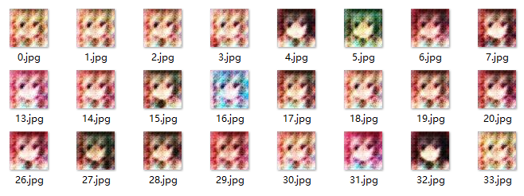

- 10轮训练

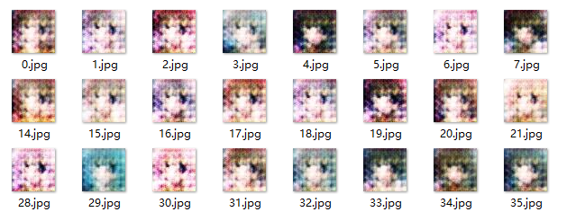

- 20轮训练

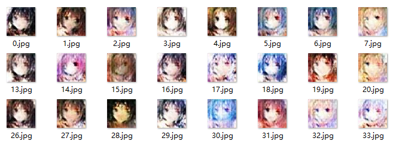

- 40轮训练


- 60轮训练


## 六、其它GAN模型

1）文本生成图像：GAWWN

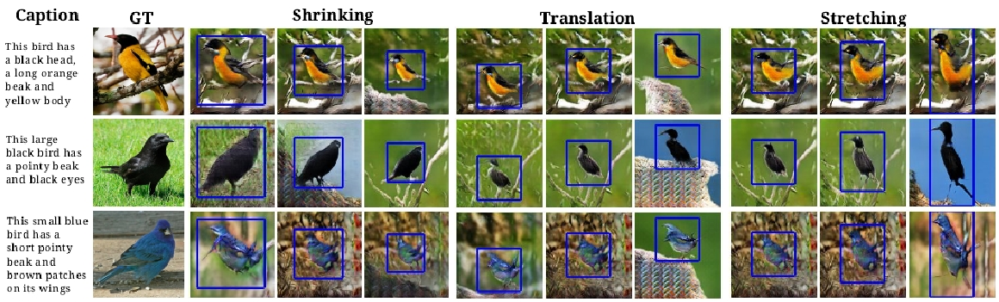


2）匹配数据图像转换：Pix2Pix


3）非匹配数据图像转换：CycleGAN，用于实现两个领域图片互转


4）多领域图像转换：StarGAN


## 七、参考资源

### 1. 在线视频

1）李宏毅GAN教程：https://www.ixigua.com/pseries/6783110584444387843/?logTag=cZwYY0OhI8vRiNppza2UW

### 2. 书籍

1）《生成对抗网络入门指南》，史丹青编著，机械工业出版社